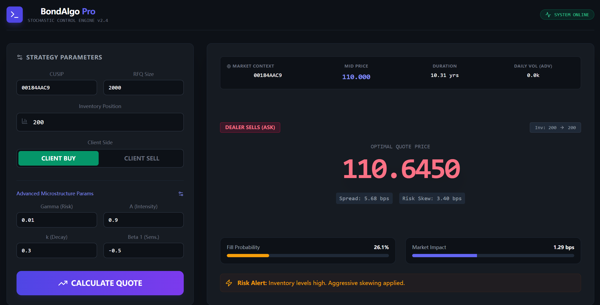

# Automated Corporate Bond Market Making via Stochastic Optimal Control + Full-Stack Dashboard

This project implements an **Event-Driven RFQ (Request for Quote) Quoting Engine** specifically designed for the US Corporate Bond market. The system leverages the **Guéant-Lehalle-Tapia (2013)** framework to provide liquidity while dynamically managing inventory risk in a fragmented, illiquid environment. The system is deployed as a **full-stack application** featuring a **Flask REST API** backend and a **React-based Trader Dashboard**, mimicking professional trading terminals like MarketAxess or Bloomberg ALLQ.

---
<p align="center">
  
</p>

## 🚀 Key Features

Beyond the theoretical framework, this engine incorporates several "production-grade" enhancements to handle real-world trading constraints:

* **Dynamic Inventory Skewing:** Implements the closed-form solution for stochastic optimal control to calculate the optimal price deviation (skew) based on current position and risk aversion ($\gamma$).
* **Microstructure-Adjusted Pricing:**
    * **Square-Root Impact Law:** Quantifies the liquidity premium required for large block trades relative to Average Daily Volume (ADV).
    * **Logistic Execution Model:** Calibrates fill probability ($P_{fill}$) based on spread width and order size to prevent "quoting out of the market."
* **Robust Safety Valves:**
    * **Inventory Dampening:** Prevents "Panic Pricing" by clipping extreme inventory inputs, ensuring the model stays competitive even during high exposure.
    * **Volatility-Linked Stop-Loss:** Implements a dynamic "Maximum Give-up" floor based on real-time volatility to protect the book during regime shifts.
* **Backend (Python/Flask):** Exposes the quantitative model via RESTful API endpoints. Handles numerical optimization and data processing.
* **Frontend (React + Tailwind):** A high-performance, dark-mode trading dashboard that features:
    * Real-time RFQ simulation.
    * Interactive parameter tuning (Gamma, Intensity, Decay).
    * Visualizations for fill probability and spread decomposition.

---

## 📂 Project Structure

```text
BondMarketMaking/
├── backend/                 # Python Logic & API
│   ├── src/                 # Quantitative Core
│   │   ├── models.py        # Microstructure Parameters
│   │   ├── pricing_system.py# Guéant-Lehalle Logic
│   │   └── engines.py       # Math Utilities
│   ├── data/                # Historical Market Data (CSV/Parquet)
│   ├── app.py               # Flask REST API Entry Point
│   └── main.py              # CLI Simulation Entry Point
│
├── frontend/                # React Dashboard
│   ├── src/
│   │   ├── Dashboard.jsx    # Main Trading UI Component
│   │   └── ...
│   └── public/
│
├── .gitignore               # Project Configuration

└── README.md                # Documentation
